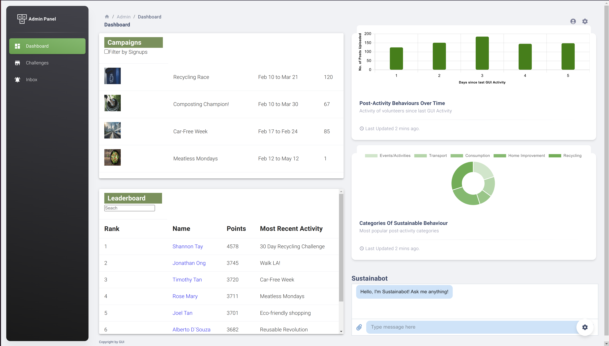
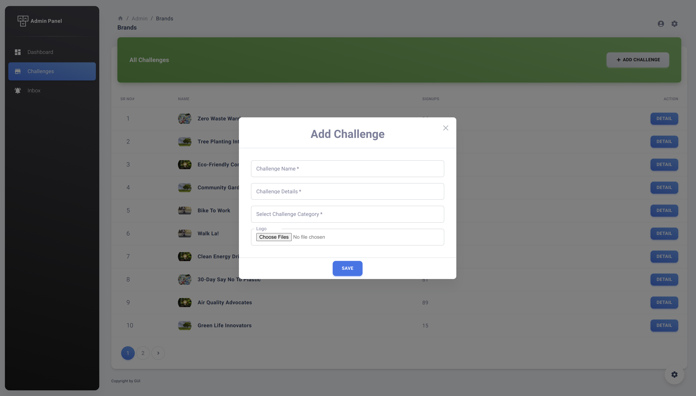

## Preview 
- Login page

  
- Dashboard with Sustainabot (AI Chatbot)
- - for the openAI API, as the github repository has been made public, the API key might be disabled so please generate your own API key from OpenAI and substitute it in the `Chatbox.js ` file at`./src/layouts/dashboard/Chatbox.js`. The location to subsitute has been commented out.

- List of Challengesss

- - - from the `Challenges` page, by clicking on `Add Challenge` button, user can create new challenges for volunteers as follows

- - - from the `Challenges` page, by clicking on `Detail` button, user can view details of each challenge and edit/delete them.

- Inbox to facilitate easy communication between GUI and volunteer queries

## How to Start this App?

In the root directory of the project, you can run this commands on terminal:
### `npm install`
### `npm start`

## Login Credentials
***
Admin have all access:
* ##### `Admin Panel/admin`: email=admin@123.com, password=admin123

## Key Technologies
***
A list of technologies used within the project:
* node v16.16.0
* npm v8.11.0
* reactjs + Material_UI for UI 
* cloud firestore for database
* complete role base authentication, authorization and protected all routes

