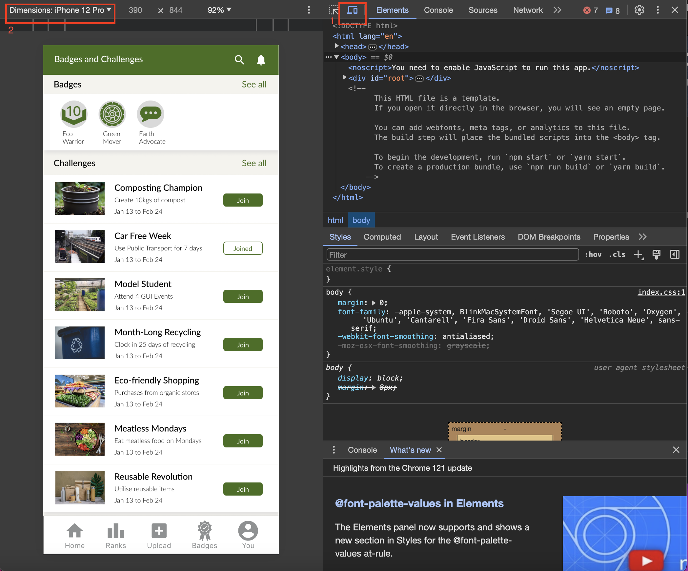
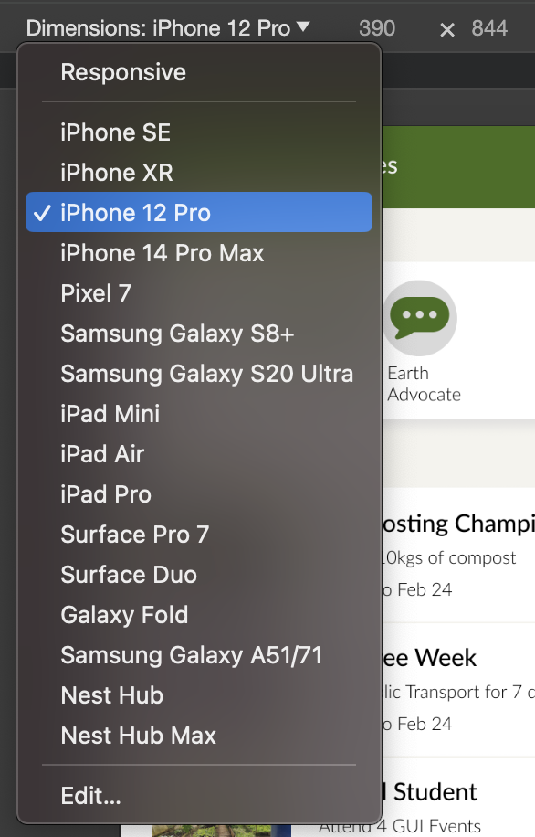

# Getting Started with the Community Scorecard App

This project was bootstrapped with [Create React App](https://github.com/facebook/create-react-app).

## Starting the web app

Clone or Download this Repository and Navigate to
`the_sustainability_scorecard` directory.

### Preferred Browser: `Chrome`

- Launch Chrome
- Right Click and Select `Inspect` or simply click on `F12` key to open inspect element window.

- Click on the `Toggle Device Toolbar` Button (Shown as 1 in the picture)
- Select `iPhone 12 Pro` or equivalent from the dropdown menu shown on selecting the `dimensions` option (Shown as 2 in Picture)
  
- Reason: The app is optimised for Mobile View and is simulating a Mobile App. For quick prototyping purposes, it was created using React.

### Command Line / Terminal Window

- Open a Command Line / Terminal Window and Navigate into the `the_sustainability_scorecard` directory.

### Command: `npm install`

- Run the above command in Command Line / Terminal to install the relevant dependencies required by the app to run.

### Command: `npm start`

- In the same Command Line / Terminal Window, run the above command.
- This runs the web app.
- Open [http://localhost:3000](http://localhost:3000) to view it in your browser (Please resize to `iPhone 12 Pro` or equivalent view port for best viewing experience).
